::: {style="text-align: right;"}
[](https://www.gnu.org/licenses/agpl-3.0.en.html) [](http://creativecommons.org/licenses/by-sa/4.0/)
:::

For the YouTube livestream schedule, see [here](https://www.youtube.com/@cytometryinr)

For screen-shot slides, click [here](/course/SDY3080/LuciernagaIntegration_slides.qmd)

<br>

---

# Background

In the [previous](/course/SDY3080/SignatureMatrices.qmd) bonus walk-through, we generated signature matrices for both our bead and cell single-color unmixing controls using the `flowGate` and `Luciernaga` R packages. The normalized fluorescent signatures were generated by extracting cells (or beads) that fell within our peak detector gates, taking the median measurement across each detector, subtracting out the equivalent background autofluorescence, and then normalizing (scaling) the values to range from 0 to 1. The normalized fluorescent signatures from all the fluorophores were then assembled together into a signature matrix. 

```{r}
#| echo: FALSE

#OutputLocation <- file.path("course", "SDY3080", "outputs")
OutputLocation <- file.path("outputs")

StoreHere <- file.path(OutputLocation, "CellInitialSignatureMatrix.csv")
CellFluorophoreSignatures <- read.csv(StoreHere, check.names=FALSE)

Plot <- Luciernaga::VisualizeSignatures(columnname="Fluorophore", data=CellFluorophoreSignatures,
 Normalize=FALSE, characterColumns="Fluorophore")

plotly::ggplotly(Plot)
```

Overall, this workflow is representative of the approach taken within most commercial softwares in the steps leading up to unmixing. Unfortunately, relying on a summary measurement ("median" in this case) often limits what we are able to perceive, and when it comes to the unmixing controls,there remains plenty of additional information that can be gleaned from the individual cells that are present. 

During [Week 12](/course/12_SpectralSignatures/index.qmd#single-color-signatures-from-individual-cells), we showcased the use of the `Luciernaga` packages `LuciernagaIntegration()` wrapper function, which permitted grouping cells based on their individual normalized cell signatures based on shared peaks, of relatively same heights. 


This approach proved useful, as it allowed us to identify the tandem degradation from APC-Fire 810 to APC that was occuring in the cell single-color controls (but strangely not the bead single-color control prepared from the same antibody vial).

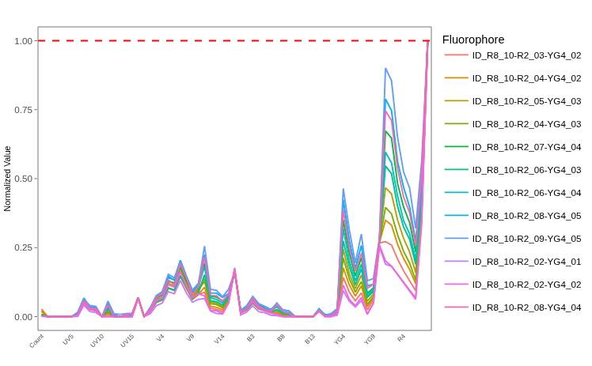

In this walk-through, we will take a look at the other 28-fluorophores in the panel, and identify any other frequently encountered patterns that can be found when we look at our unmixing controls with such a granular view. We will also explore how to leverage this information to better inform which signatures we incorporate into the final fluorophore signature matrix for use in [unmixing](/course/14_Unmixing/index.qmd) the full-stained samples. 

# Walk Through

## Set Up

### Retrieving GatingSet

We will begin by loading the R packages we need today to our local environment, via the `library()` call. As a [reminder](/course/SDY3080/SignatureMatrices.qmd#checking-package-versions), we will need to have at least `Luciernaga` version 0.99.10 installed to use the functions (for reasons covered during the [last](/course/SDY3080/SignatureMatrices.qmd#checking-package-versions) bonus walk-through). 

```{r}
library(dplyr)
library(purrr)
library(flowWorkspace)
library(Luciernaga)
library(ggplot2)
```

Next up, specify the storage (currently containing our .fcs files) and output (currently containing our intermediate .gs folder) locations. If you are following the courses organization scheme, these would be in the "data" and "outputs" folders respectively.  

```{r}
#StorageLocation <- file.path("course", "SDY3080", "data", "SDY3080")
StorageLocation <- file.path("data", "SDY3080")

#OutputLocation <- file.path("course", "SDY3080", "outputs")
OutputLocation <- file.path("outputs")
```

With these file paths set up, lets proceed to load our CellSC_GatingSet back into the local environment from its .gs folder. This would be the "Amplified" version, where the peak detector gates had been created, checked and corrected. 

```{r}
CellSCPath <- file.path(OutputLocation, "CellsSC_GS_Amplified.gs")
CellsSC_GatingSet <- load_gs(CellSCPath)
```

And lets go ahead and plot the gates, just to make sure everything remains as it should be. 

```{r}
#| eval: TRUE
plot(CellsSC_GatingSet)
```

### Assembling Template

Since `LuciernagaIntegration()` wrapper function relies on the use of a template for matching the individual single-color control specimen with the corresponding peak detector gate, we can reasseble the template by retrieving the updated metadata using `pData()`. When re-retrieving metadata from a GatingSet, the metadata columns order may end up rearranged, so lets also reorganize the columns based on the expected order we previously had them in. 

```{r}
Template <- pData(CellsSC_GatingSet)
Template <- Template |> relocate(Fluorophore, Antigen, Type, Detector, Negative, .after="name")
```

```{r}
rownames(Template) <- NULL
head(Template, 3)
```

We can also optionally remove the 3 samples that we previously choose not to investigate using the `dplyr` packages `filter()` function on the data.frame object. We can save this subsetted output as a new object/variable, "KeptCells". 

```{r}
KeptCells <- Template |>
     filter(!name %in% "DTR_2023_ILT_01-Reference Group-DR_Dump_CD19 Pacific Blue (Cells).1235702.fcs") |>
     filter(!name %in% "DTR_2023_ILT_01-Reference Group-DR_Viability_PMA Zombie NIR (Cells).1235709.fcs") |>
     filter(!name %in% "DTR_2023_ILT_01-Reference Group-DR_CD3 Alexa Fluor 488 (Cells).1235688.fcs") 
```

```{r}
#| eval: TRUE
KeptCells
```

### Rearranging by Detector

Before diving too far in, you may notice the rows in our current template are not exactly ordered in terms of the laser and emission wavelength of the respective fluorophores.  We can fix this setting `factor()` on the detector column (providing the correct detector order via the levels argument). At that point, we can use the `dplyr` packages `arrange()` function to re-shuffle the rows to match the designated factor ordering. 

```{r}
DetectorOrder <- c("UV1", "UV2", "UV3", "UV4", "UV5", "UV6", "UV7", "UV8",
               "UV9", "UV10", "UV11", "UV12", "UV13", "UV14", "UV15", "UV16",
               "V1", "V2", "V3", "V4", "V5", "V6", "V7", "V8",
               "V9", "V10", "V11","V12", "V13", "V14", "V15", "V16",
               "B1", "B2", "B3", "B4", "B5", "B6", "B7", "B8",
               "B9", "B10", "B11", "B12", "B13", "B14",
               "YG1", "YG2", "YG3", "YG4", "YG5", "YG6", "YG7", "YG8", "YG9", "YG10",
               "R1", "R2", "R3", "R4", "R5", "R6", "R7", "R8")

KeptCells$Detector <- factor(KeptCells$Detector, levels=DetectorOrder)

KeptCells <- KeptCells |> arrange(Detector)
```

```{r}
KeptCells
```

An added benefit of this means we can now use R notation for rows ([1,], [2,], etc.) to sequentially isolate out from the panel GatingSet just the individual fluorophores we want to work with by providing smaller versions of the actual template. 

```{r}
KeptCells[1,]
```

```{r}
KeptCells[29,]
```

```{r}
#| echo: FALSE
SaveThisTemplateHere <- file.path(OutputLocation, "KeptCells.csv")
write.csv(KeptCells, SaveThisTemplateHere, row.names=FALSE)
```

## Cell Single-Color Controls

Before getting started, lets quickly recall which fluorophores that are present in this 29-fluorophore panel

```{r}
Panel <- KeptCells |> select(Fluorophore, Antigen) |> mutate(Day=1)
Table <- FluorophoreMatrix(data=Panel, NumberDetectors = 64) # Aurora 5-laser
```

```{r}
Table
```

As we start to evaluate fluorophore signatures, an important thing to remember is that what we (and our cytometers) perceive as brightness is a combination of

- The antigen density on the cell surface that our antibody-conjugated fluorophores will bind to. 

- The individual fluorophores capacity to emit photons back when the respective laser excites it (as well as our instruments ability to capture this emmitted signal)

- Some variable amount of background autofluorescence (from either our cell or bead)

- Some additional amount of uncertainty or noise for good measure from various sources.

As we consider signature variants while profiling the normalized fluorescent signatures of individual cells, its often useful to try to mentually contextualize what we are seeing in light of these factors listed above. We will revisit these points in finer detail as we navigate through this walk-through. But for now, lets get started!


### Ultra Violet

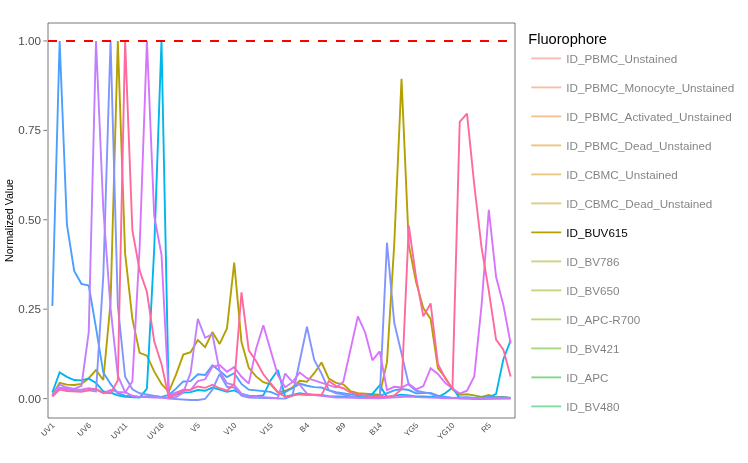 

#### BUV395

Lets start with our [BUV395](https://www.bdbiosciences.com/en-us/products/reagents/flow-cytometry-reagents/research-reagents/single-color-antibodies-ruo/buv395-mouse-anti-human-cd62l.565219?tab=product_details) single-color unmixing control, which is conjugated to [CD62L](https://en.wikipedia.org/wiki/L-selectin). 

Since it is located in the first row of our "data.frame", we can subset it out from the broader "KeptCells" template using "[1,]". We can pass this subsetted template alongside our GatingSet object to the  `LuciernagaIntegration()` wrapper function for processing. 

```{r}
BUV395 <- LuciernagaIntegration(template=KeptCells[1,], 
  gs=CellsSC_GatingSet, GuessSimilar=TRUE)[[1]] # Square brackets to loose list notation
```

The `LuciernagaIntegration()` function in turn returns to us a list object. 

```{r}
class(BUV395)
```

If we run `names()`, we can see the actual contents appear to be a mix of both "data.frames" and "ggplot plots", corresponding to the various `Luciernaga` functions that were run by the wrapper. 

```{r}
names(BUV395)
```

This allows us to quickly visualize via the different options, while retaining the ability to subsequently retrieve the underlying data for subsequent downstream analysis steps.

We can start by retrieving the output of `Luciernaga_LinearSlices()`, which is stored under the "LinearSlices_Plot" entry. This function splits the gated region into 10% bins across, and returns the averaged normalized signature for the cells that are present within each of the bins. This plot in turn can be passed to `plotly`'s `ggplotly()` function to render it interactive.

```{r}
Plot <- BUV395$LinearSlices_Plot
plotly::ggplotly(Plot)
```

Across the board, it doesn't appear that the normalized signature has changed substantially, as looking across the various bins the signatures appear mostly consistent. 

Having noted this, we can next check the stored plot present under "LuciernagaQC_Signatures", which is the wrapped return from the `LuciernagaQC()` function that orchestrates the grouping of cells based on their individual normalized signatures based on peak detector location and relative height.

```{r}
Plot <- BUV395$LuciernagaQC_Signatures
plotly::ggplotly(Plot)
```

Using this approach, we find the same signature that was seen by the prior approach ("UV2_10", consisting of a single emission peak located at the "UV2" detector, i.e. normalized height of 1.00). However, we also retrieved a couple additional signature variants, with the presence of secondary peaks at the "V7" detector, that are of different heights relative to the peak "UV2" detector ("V7_02" ~ 20% height of UV2, "V7_03" ~ 30% height of UV2).

Given the location ("V7-A"), it is likely that this new peak in these two variant signatures is residual autofluorescence that wasn't fully subtracted out for their individual cells. 

While we can see there are variant signatures with residual autofluorescence present, this doesn't tell us much information about how prevalent they might be. Within our returned list, we also have a "ProportionPlot" that tells us how the cells within our gated region where distributed between the signature variants. 

```{r}
Plot <- BUV395$ProportionPlot
plotly::ggplotly(Plot)
```

In this case, around 80% of the cells had the standard signature, while 20% of the cells were better represented by the other two variant signatures. Within our `LuciernagaIntegration()` output list we also get back the `QC_Amalgamate()` functions output under the "LuciernagaQC_AmalgamatedPlot" entry. This will visualize all the signature variants, while also showing where the overall median signature would end up. 

```{r}
Plot <- BUV395$LuciernagaQC_AmalgamatedPlot
plotly::ggplotly(Plot)
```

As we can see, in this case the "Average" and "UV2_10" signatures are practically indistinguishable, with the contribution of the variant signatures not affecting the overall shape of the signature. 

Going back to the list, lets retrieve the underlying data for our plot ("AveragedSignature_Data")

```{r}
Data <- BUV395$AveragedSignature_Data
Data
```

In this particular case, we have relatively few signature variants, but for practice for the upcoming fluorophores, lets retrieve the average as well as variants with minimal and maxinum autofluorescence contribution of the autofluorescence peak for subsequent signature comparison steps. 

```{r}
Data <- BUV395$AveragedSignature_Data |>
   filter(Cluster %in% c("UV2_10", "Average", "UV2_10-V7_03"))
```

With this accomplished, we can carry out some of the signature comparison steps we encountered during [Week 13](/course/13_SpectralSimilarities/index.qmd). We can start off by passing each individual signature to  `QC_SimilarFluorophores()` to better gage the differences between them. 

```{r}
QC_WhatsThis(x="UV2_10", columnname="Cluster", data=Data, NumberHits=5, NumberDetectors=64, returnPlots=FALSE)
```

```{r}
QC_WhatsThis(x="Average", columnname="Cluster", data=Data, NumberHits=5, NumberDetectors=64, returnPlots=FALSE)
```

```{r}
QC_WhatsThis(x="UV2_10-V7_03", columnname="Cluster", data=Data, NumberHits=5, NumberDetectors=64, returnPlots=FALSE)
```

From the above, both "Average" and "UV2_10" (i.e. 'single peak at UV2, height 1.0') are matches for the "BUV395" reference signature. The cosine value drops for the "UV2_10-V7_03" (i.e. peak detector at UV2, height 1.0; second peak at V7, relative height 0.3 to main peak) signature variant, where the cosine value is 0.92

If we visualized the difference in these angles, we would see the following

```{r}
#| code-fold: TRUE
cos_vals <- c(1, 1, 0.92)
theta <- acos(cos_vals)

df <- data.frame(
  label = paste0("cos = ", cos_vals),
  angle_deg = round(theta * 180 / pi, 1),
  x = sin(theta),
  y = cos(theta)
)

ggplot(df) +
  geom_segment(aes(x = 0, y = 0, xend = x, yend = y, color = label),
               arrow = arrow(length = unit(0.25, "cm")),
               linewidth = 1) +
  coord_fixed(xlim = c(-0.1, 1), ylim = c(-0.1, 1.1)) +
  geom_hline(yintercept = 0, color = "grey80") +
  geom_vline(xintercept = 0, color = "grey80") +
  labs(x = NULL, y = NULL, color = "Vector",
       title = NULL) +
  theme_bw()
```

So in this case, the variant with residual autofluorescence if utilized as the unmixing reference signature would likely result in a fairly substantial unmixing error. 


:::{.callout-tip title="Pass"}
80% of the cells within our gated region are a match for the BUV395 reference signature. The other 20% of cells have residual autofluorescence contribution, which can cause a shift in the overall signature. While not abundant enough to impact the overall signature, if we wanted to prevent this scenario, we could always shift our original positive gate to the right (retaining only the brighter cells) which should reduce the overall prevalence of these two signature variants. 
:::

#### BUV496

Next up in terms of laser and peak emission detecter we have one of the most autofluorescence similar fluorophores, [BUV496](https://www.bdbiosciences.com/en-us/products/reagents/flow-cytometry-reagents/research-reagents/single-color-antibodies-ruo/buv496-mouse-anti-human-cd8.612942?tab=product_details), conjugated in this case to [CD8](https://en.wikipedia.org/wiki/CD8). Given that CD8 is a "primary" marker, and how we placed the gate, this antigen-fluorophore combination has a decent chance of being reasonably bright. 

```{r}
BUV496 <- LuciernagaIntegration(template=KeptCells[2,], gs=CellsSC_GatingSet, GuessSimilar=TRUE)[[1]] # Square brackets to loose list notation
```

As was the case for the BUV395, we can start by checking the "LinearSlices_Plot", which allows us to visualize the effect on the overall retrieved signature if we had split the region within out "positive" gate into 10% bins of increasing brightness. 

```{r}
Plot <- BUV496$LinearSlices_Plot
plotly::ggplotly(Plot)
```

As we might anticipate given the antigen-fluorophore pairing (alongside best practices on gate placement), there are no significant differences in the signature retrieved across the individual 10% bins. 

We can follow up by checking the `LuciernagaQC()` output stored in "LuciernagaQC_Signatures", which will group  individual cell normalized signatures on the basis of shared peak and height

```{r}
Plot <- BUV496$LuciernagaQC_Signatures
plotly::ggplotly(Plot)
```

At which point, we can see only one signature is present across the board. We can go ahead and call it for this fluorophore on the other comparisons. 

:::{.callout-tip title="Pass"}
For BUV496, only 1 normalized fluorescent signature was present in the cells within the gated region of our reference control, so no changes are needed.  
:::


#### BUV563

Next up, we have [BUV563](https://www.bdbiosciences.com/en-us/products/reagents/flow-cytometry-reagents/research-reagents/single-color-antibodies-ruo/buv563-mouse-anti-human-cd69.748764?tab=product_details), which is conjugated to [CD69](https://en.wikipedia.org/wiki/CD69). 

One thing to keep in mind, this would be one of the single-color unmixing controls that would have been prepared with the [PMA-ionomycin](https://www.thermofisher.com/us/en/home/life-science/cell-analysis/cell-analysis-learning-center/immunology-at-work/immunology-protocols/stimulation-cytokine-production-immune-cells.html) activated cells. The `LuciernagaIntegration()` wrappers default is to use the internal negative, but still worth keeping an eye on and see how it behaves compared to the previous fluorophores.

```{r}
BUV563 <- LuciernagaIntegration(template=KeptCells[3,], gs=CellsSC_GatingSet, GuessSimilar=TRUE)[[1]] # Square brackets to loose list notation
```

As was the case for the previous fluorophores, we can start by checking the "LinearSlices_Plot", to see what the effect would have been on the signature if we had split the cells within our "positive" gate into 10% bins across. 

```{r}
Plot <- BUV563$LinearSlices_Plot
plotly::ggplotly(Plot)
```

We have a similar situation as what we encountered with [BUV496](/course/SDY3080/LuciernagaIntegration.qmd#buv496). Lets go ahead and check the `LuciernagaQC()` output to see if we see any variant signatures when we group the individual cell normalized signatures by shared peak and height

```{r}
Plot <- BUV563$LuciernagaQC_Signatures
plotly::ggplotly(Plot)
```

In this case, we get back a few variant signatures, but at first glance the differences seem minimal (secondary peak "YG2" being either 20 or 30% of the primary "UV9" peak, tertiary peak "B4" either 20 or 30% of the primary "UV9" peak). These differences are likely going to be minor, driven by how `Luciernaga_QC()` goes about its rounding. 

Lets still carry out the comparisons for practice for the upcoming fluorophores. We can check to see what the average would have looked like by checking the output stored under "LuciernagaQC_AmalgamatedPlot"

```{r}
Plot <- BUV563$LuciernagaQC_AmalgamatedPlot
plotly::ggplotly(Plot)
```

As anticipated, minimal. How were these signatures distributed across the gated cells? We can also check the output under "ProportionPlot"

```{r}
Plot <- BUV563$ProportionPlot
plotly::ggplotly(Plot)
```

So most cells have a secondary peak "YG2_03", with a bit of wobble on the "B4" detector. For good measure, lets go ahead and pull the "Cosine" plot. 

```{r}
Plot <- BUV563$CosineSimilarityPlot
plotly::ggplotly(Plot)
```


At this point, it feels unecesary to dive further since the variants all have cosine values of 1, but we can check the "Average" signature using `QC_WhatsThis()` for final verification. 

```{r}
Data <- BUV563$AveragedSignature_Data
```

```{r}
QC_WhatsThis(x="Average", columnname="Cluster", data=Data, NumberHits=5, NumberDetectors=64, returnPlots=FALSE)
```

:::{.callout-tip title="Pass"}
For BUV563, we didn't find any substantial signature variants, so our gate is likely fine as placed, and we can move on to screening the next fluorophore. 
:::

#### BUV615

Up next, we have [BUV615](bdbiosciences.com/en-us/products/reagents/flow-cytometry-reagents/research-reagents/single-color-antibodies-ruo/buv615-mouse-anti-human-cd194.613000), which is conjugated to [CCR4](https://en.wikipedia.org/wiki/CCR4). As far as classifying marker expression, this one is more on the chemokine side, so we should expect lower antigen density compared to what we saw for primary markers like [BUV496 CD8](/course/SDY3080/LuciernagaIntegration.qmd#buv496). 

```{r}
BUV615 <- LuciernagaIntegration(template=KeptCells[4,], gs=CellsSC_GatingSet, GuessSimilar=TRUE)[[1]] # Square brackets to loose list notation
```

First up, the "LinearSlices_Plot" output to check whether we would have retrieved any variant signatures had we split our "positive" gated region into 10% bins. 

```{r}
Plot <- BUV615$LinearSlices_Plot
plotly::ggplotly(Plot)
```

Oooh look, a new pattern! While the main signature peaks are uniform across all the percentile signatures, there is [step-ladder](https://en.wiktionary.org/wiki/step_ladder) appearance around the "V5" through "V7" peaks (as well as the "UV7" detector). 

With these differences noted, lets check out the `LuciernagaQC()` output stored under "LuciernagaQC_Signatures" to see how many variant signatures we got from the grouped individual cell normalized signatures. 

```{r}
Plot <- BUV615$LuciernagaQC_Signatures
plotly::ggplotly(Plot)
```

We have unlocked our first misbehaving fluorophore! We can see that all the signature variants share the same main peak ("UV10"). They also share the secondary peak ("YG3"), although this varies in height (from 80% to 100% of the main "UV10" detector). The third shared peak height is even more variable (ranging from 20 to 60% of the main "UV10" peak). All together, this may be indicative of ongoing tandem decoupling to a certain extent. 

Additionally, the signatures that have a higher tertiary "V10" peak also exhibit higher signal in the regions that are typical of lymphocyte autofluorescence ("UV7", "V7", "B3"). This suggest potentially that residual autofluorescence is being leftover in the signature after background subtraction. 

So we have signature variants, but we don't know how prevalent they are. Lets go ahead and check under the "LuciernagaQC_AmalgamatedPlot" output to see what the median ("Average") signature ends up at when accounting for all the cells present in the gate

```{r}
Plot <- BUV615$LuciernagaQC_AmalgamatedPlot
plotly::ggplotly(Plot)
```

Unlike the case we saw for [BUV395 CD62L](/course/SDY3080/LuciernagaIntegration.qmd#buv395), the "Average" seems to be in the middle of the signature variants for the "V10" detector, suggesting its being influenced by the variants. For comparison, lets see what the BUV615 reference signature looks like for context.  

```{r}
Plot <- QC_ReferenceLibrary("BUV615", returnPlots=TRUE, NumberDetectors=64)[[2]]
plotly::ggplotly(Plot)
```

So overall, the reference has a "YG3" detector closer to 0.9, a "V10" detector closer to "0.3", so we are retrieving signature variants positioned both below and above it in regards to the "V10" detector height. We can next `filter()` for the average, as well as variant signatures with minimal and maxinum heights of the tertiary "V10" peak. 

```{r}
Data <- BUV615$AveragedSignature_Data |>
   filter(Cluster %in% c("UV10_10-YG3_09-V10_02", "Average", "UV10_10-YG3_09-V10_06"))
```

Lets pass these individually to `QC_SimilarFluorophores()` and gage the difference. 

```{r}
QC_WhatsThis(x="UV10_10-YG3_09-V10_02", columnname="Cluster", data=Data, NumberHits=5, NumberDetectors=64, returnPlots=FALSE)
```

```{r}
QC_WhatsThis(x="Average", columnname="Cluster", data=Data, NumberHits=5, NumberDetectors=64, returnPlots=FALSE)
```

```{r}
QC_WhatsThis(x="UV10_10-YG3_09-V10_06", columnname="Cluster", data=Data, NumberHits=5, NumberDetectors=64, returnPlots=FALSE)
```

As we may have anticipated, the signature variant "UV10_10-YG3_09-V10_06" which appeared to have the greatest amount of autofluorescence residual is the most different, coming back with a cosine value of 0.9.  Lets visualize these retrieved cosines. 

```{r}
#| code-fold: TRUE
cos_vals <- c(1, 1, 0.90)
theta <- acos(cos_vals)

df <- data.frame(
  label = paste0("cos = ", cos_vals),
  angle_deg = round(theta * 180 / pi, 1),
  x = sin(theta),
  y = cos(theta)
)

ggplot(df) +
  geom_segment(aes(x = 0, y = 0, xend = x, yend = y, color = label),
               arrow = arrow(length = unit(0.25, "cm")),
               linewidth = 1) +
  coord_fixed(xlim = c(-0.1, 1), ylim = c(-0.1, 1.1)) +
  geom_hline(yintercept = 0, color = "grey80") +
  geom_vline(xintercept = 0, color = "grey80") +
  labs(x = NULL, y = NULL, color = "Vector",
       title = NULL) +
  theme_bw()
```

And finally, lets go ahead and check the "CosineSimilarityPlots" and the "ProportionPlot" before we make a decision

```{r}
Plot <- BUV615$ProportionPlot
plotly::ggplotly(Plot)
```

```{r}
Plot <- BUV615$CosineSimilarityPlot
plotly::ggplotly(Plot)
```

So ultimately, we have 5% of overall cells with the degraded/high-autofluorescence residual signature. 

:::{.callout-warning title="Fail"}
While there are still cells present that maintain BUV615 signature (and we might still rescue this control by moving the gate substantially to the right), there are clear warning signs that this particular single-color unmixing control is not in good shape, with evidence for both tandem-degradation and also residual autofluorescence contamination. Whether this is due to cell-specific degradation (like what we encountered for APC-Fire 810 during [Week 12](/course/12_SpectralSignatures/index.qmd)) or at the antibody vial level is something that would need to be investigated separately. 

Ultimately, this was one of the antibody-fluorophore combinations for our panel that consistently caused notable unmixing issues, and it wasn't until we switched it over to a bead single-color unmixing control that the issues cleared up, which formed the basis for our [CYTO 2025](https://davidrach.github.io/SingleColors_Cyto2025/SingleColorsPoster.pdf) poster. 
:::

#### BUV661

Continuing on, we reach the [BUV661](bdbiosciences.com/en-us/products/reagents/flow-cytometry-reagents/research-reagents/single-color-antibodies-ruo/buv661-mouse-anti-human-v-2-tcr.750056) fluorophore, which was conjugated to [Vδ2](https://en.wikipedia.org/wiki/Gamma_delta_T_cell#Human_V%CE%B42+_T_cells). For the [original study](https://www.frontiersin.org/journals/immunology/articles/10.3389/fimmu.2025.1628145/full), the Vγ9Vδ2 T cells cells were one the main cell subsets of interest. 

While the antigen is typically expressed highly, we would normally anticipate having bright antibody-fluorophore staining. However, the Vδ2 T cell frequency can vary person to person, which means routine use in a cell single-color unmixing control requires pre-screening donors for one with high enough percentage to make acquisition sufficient bright events feasible. 

```{r}
BUV661 <- LuciernagaIntegration(template=KeptCells[5,], gs=CellsSC_GatingSet, GuessSimilar=TRUE)[[1]] # Square brackets to loose list notation
```

As usual, we can check the "LinearSlices_Plot", to see what the effect would have been on the signature if we had split the "positive" gate into 10% bins across. 

```{r}
Plot <- BUV661$LinearSlices_Plot
plotly::ggplotly(Plot)
```

So far, minimal differences across the percentile bins. Lets isntead check the `LuciernagaQC()` output to see if there are any signature variants retrieved when we group individual cell normalized signatures based on shared peak and height. 

```{r}
Plot <- BUV661$LuciernagaQC_Signatures
plotly::ggplotly(Plot)
```

Two signature variants, with slightly different R1/R2 peak heights. When taking the median, where does the "Average" signature end up?

```{r}
Plot <- BUV661$LuciernagaQC_AmalgamatedPlot
plotly::ggplotly(Plot)
```

"Average" ends up closer to the signature with the secondary "R2_09" peak. So overall, this antigen-fluorophore combination appears to be behaving. We can wrap up by checking the cosine values. 

```{r}
Data <- BUV661$AveragedSignature_Data
```

```{r}
Plots <- QC_WhatsThis(x="UV11_10-R2_08-YG5_04", columnname="Cluster", data=Data, NumberHits=5, NumberDetectors=64, returnPlots=TRUE)

Plots[[1]]
```

```{r}
Plots <- QC_WhatsThis(x="UV11_10-R2_09-YG5_04", columnname="Cluster", data=Data, NumberHits=5, NumberDetectors=64, returnPlots=TRUE)

Plots[[1]]
```

```{r}
plotly::ggplotly(Plots[[2]])
```

:::{.callout-tip title="Pass"}
For our BUV661, only two signature variants, both which match the reference fluorophore (with minor difference in the secondary "R2" peaks height). This minor difference may be due to difference in tandem batch conjugation or instrumental factors, but as long as we are using the same antibody on our full-stained samples as we do our single-color control, we should be okay. 
:::

#### BUV737

Up next, we have [BUV737](https://www.bdbiosciences.com/en-us/products/reagents/flow-cytometry-reagents/research-reagents/single-color-antibodies-ruo/buv737-mouse-anti-human-cd183.741866?tab=product_details), conjugated to [CXCR3](https://en.wikipedia.org/wiki/CXCR3). Given the ligand, the antigen-fluorophore combination may be expected to have some brightness issues similar to what we saw for [BUV615 CCR4](/course/SDY3080/LuciernagaIntegration.qmd#buv615) 

```{r}
BUV737 <- LuciernagaIntegration(template=KeptCells[6,], gs=CellsSC_GatingSet, GuessSimilar=TRUE)[[1]] # Square brackets to loose list notation
```

Lets first take a look at the "LinearSlices_Plot", to see if there would have been an effect on the signature if we had split the "positive" gated region across 10% bins. 

```{r}
Plot <- BUV737$LinearSlices_Plot
plotly::ggplotly(Plot)
```

Right off, we notice patterns similar to what we saw for [BUV615 CCR4](/course/SDY3080/LuciernagaIntegration.qmd#buv615), with the main fluorophore peaks ("UV14" and "R5") being shared across 10% bins, but uncertainty ladden step-ladder peaks for "V7", "B3" and "UV7" detectors. 

Lets break out `LuciernagaQC()` output and see what the grouped individual cell normalized signature variants are up to.

```{r}
Plot <- BUV737$LuciernagaQC_Signatures
plotly::ggplotly(Plot)
```

We have a fuzzy [caterpillar](https://en.wikipedia.org/wiki/Pyrrharctia_isabella)! At this point, we are getting back way to many signature variants, many of these not well defined (likely due to insufficient number events) which contributes to the fuzzy appearance.  

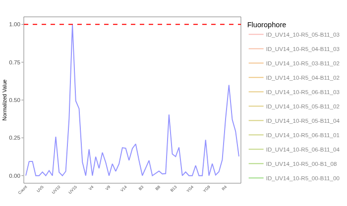

Lets see if we can at least make out the main signature appearance by checking the `QC_AmalgamatedPlot()` output

```{r}
Plot <- BUV737$LuciernagaQC_AmalgamatedPlot
plotly::ggplotly(Plot)
```

While "UV14" appears to be fairly shared, "R5" and "B11" appear to be wildly variable in terms of height. This is typical either in situations where the antibody didn't really stain well (ending up with very dim signal, mainly consistent of non-specific staining), or major tandem degradation. 

Let's check "ProportionPlot" and identify the signatures that represent the majority of the cells present

```{r}
Plot <- BUV737$ProportionPlot
plotly::ggplotly(Plot)
```

Not particularly helpful, but if we zoom in, we can find  "UV14_10-R5_06-B11_03", "UV14_10-R5_05-B11_03", "UV14_10-R5_04-B11_03", "UV14_10-R5_04-B11_02" and "UV14_10-R5_03-B11_02" have more than 5% of total cells each. 

Lets retrieve the underlying data for this plot, and select for these. 

```{r}
Data <- BUV737$AveragedSignature_Data |>
   filter(Cluster %in% c("UV14_10-R5_06-B11_03","UV14_10-R5_05-B11_03", "UV14_10-R5_04-B11_03", "UV14_10-R5_03-B11_02", "Average"))
```

Lets pass these individually to `QC_SimilarFluorophores()` and gage the difference. 

```{r}
QC_WhatsThis(x="UV14_10-R5_04-B11_03", columnname="Cluster", data=Data, NumberHits=5, NumberDetectors=64, returnPlots=FALSE) # 0.92
```

```{r}
QC_WhatsThis(x="Average", columnname="Cluster", data=Data, NumberHits=5, NumberDetectors=64, returnPlots=FALSE) # 0.97
```

```{r}
QC_WhatsThis(x="UV14_10-R5_06-B11_03", columnname="Cluster", data=Data, NumberHits=5, NumberDetectors=64, returnPlots=FALSE) # 0.98
```

Overall, for these more prevalent signatures, none match the BUV737 reference, ranging from 0.92 to 1.0 in terms of their cosine. Lets plot these angles for reference

```{r}
#| code-fold: TRUE
cos_vals <- c(1, 0.92, 0.97, 0.98)
theta <- acos(cos_vals)

df <- data.frame(
  label = paste0("cos = ", cos_vals),
  angle_deg = round(theta * 180 / pi, 1),
  x = sin(theta),
  y = cos(theta)
)

ggplot(df) +
  geom_segment(aes(x = 0, y = 0, xend = x, yend = y, color = label),
               arrow = arrow(length = unit(0.25, "cm")),
               linewidth = 1) +
  coord_fixed(xlim = c(-0.1, 1), ylim = c(-0.1, 1.1)) +
  geom_hline(yintercept = 0, color = "grey80") +
  geom_vline(xintercept = 0, color = "grey80") +
  labs(x = NULL, y = NULL, color = "Vector",
       title = NULL) +
  theme_bw()
```

Ultimately, this just looks like a mess. Whether its due to a dim antigen-fluorophore combinations or tandem degradation is a story for another day.

:::{.callout-warning title="Fail"}

For BUV737, this one is an immediate NO! The sheer number of variants with different heights around the secondary and tertiary peaks suggest that the tandem likely degraded. 

Likewise, the step-ladders around the autofluorescence typical peaks result when the antigen-fluorophore combination is not bright enough, resulting in leftover autofluorescence residuals after background subtraction contributing significantly more to the signature shape.

This is also consistent with tandem degradation scenario, since the peaks would not be as bright as they should be to render this leftover residual insignificant compared to the overall signature. 

Additionally, we can't rule out that the antibody clone could also be a bad one, since if there was no binding to the antigen, there would no direct staining, and what we could be gating on might just be the result of non-specific noise, further adding to the dim signal/overall fuzzyness. 

Ultimately, replacing this cell unmixing control for its bead single-color unmixing control is no brainer, and we should check the full-stained sample to see if there is CXCR3 staining after unmixing to determine whether the antibody clone is the root cause or not.
:::

#### BUV805

And wrapping up our exploration of the UV laser fluorophores, lets check out the [BUV805](bdbiosciences.com/en-us/products/reagents/flow-cytometry-reagents/research-reagents/single-color-antibodies-ruo/buv805-mouse-anti-human-cd4.612887) fluorophore, which is conjugated to [CD4](https://en.wikipedia.org/wiki/CD4). Given antigen density on a CD4 T cell, this should prove less complicated than the mess that was [BUV737 CXCR3](/course/SDY3080/LuciernagaIntegration.qmd#buv737)

```{r}
BUV805 <- LuciernagaIntegration(template=KeptCells[7,], gs=CellsSC_GatingSet, GuessSimilar=TRUE)[[1]] # Square brackets to loose list notation
```

Lets first take a look at the "LinearSlices_Plot", to see what effect would have been on the signature if we had split the cells within our "positive" gate into 10% bins across based on brightness. 

```{r}
Plot <- BUV805$LinearSlices_Plot
plotly::ggplotly(Plot)
```

Pretty much no difference on the autofluorescence detectors, so very similar to what we saw for [BUV496 CD8](/course/SDY3080/LuciernagaIntegration.qmd#buv496). Lets check out the `LuciernagaQC()` output to see what happens when we group individual cell normalized signatures based on shared peaks of similar height

```{r}
Plot <- BUV805$LuciernagaQC_Signatures
plotly::ggplotly(Plot)
```

And we end up with just 1 signature. Lets wrap this up by comparing to the reference. 

```{r}
Data <- BUV805$AveragedSignature_Data 
```

```{r}
QC_WhatsThis(x="Average", columnname="Cluster", data=Data, NumberHits=5, NumberDetectors=64, returnPlots=FALSE)
```

:::{.callout-tip title="Pass"}
For BUV805, we only retrieved 1 signature, likely due to the antigen-fluorophore combination being a bright one, and the tandem being in good shape. We are good to proceed to the next fluorophore!
:::

### Violet

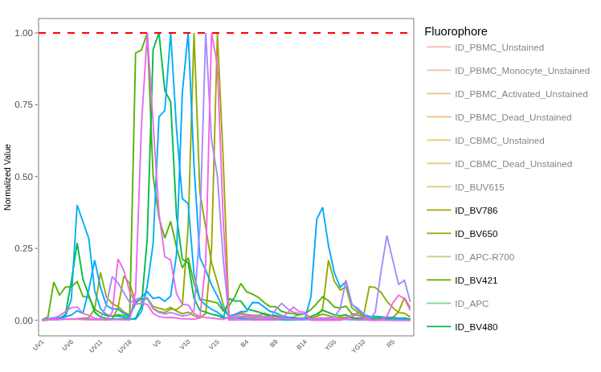

Due to the sheer number of `plotly` `ggplotly()` interactive plots that the website would need to load if we had visualized all the `LuciernagaIntegration()` plots for the 29-fluorophore panel in one go, we have broken the exploration of the fluorophore outputs by laser. The walk-through of the "Violet" fluorophores has been migrated [here](/course/SDY3080/LuciernagaIntegration_Violet.qmd).  

### Blue

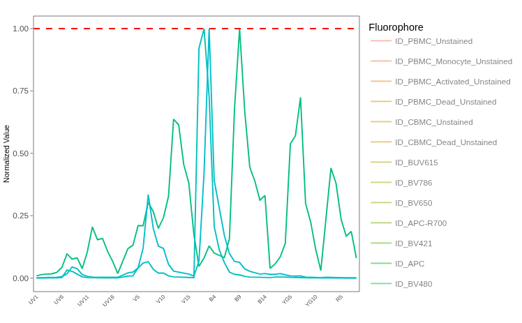

Due to the sheer number of `plotly` `ggplotly()` interactive plots that the website would need to load if we had visualized all the `LuciernagaIntegration()` plots for the 29-fluorophore panel in one go, we have broken the exploration of the fluorophore outputs by laser. The walk-through of the "Blue" fluorophores has been migrated [here](/course/SDY3080/LuciernagaIntegration_Blue.qmd). 

### Yellow-Green


Due to the sheer number of `plotly` `ggplotly()` interactive plots that the website would need to load if we had visualized all the `LuciernagaIntegration()` plots for the 29-fluorophore panel in one go, we have broken the exploration of the fluorophore outputs by laser. The walk-through of the "Yellow-Green" fluorophores has been migrated [here](/course/SDY3080/LuciernagaIntegration_YellowGreen.qmd). 

### Red

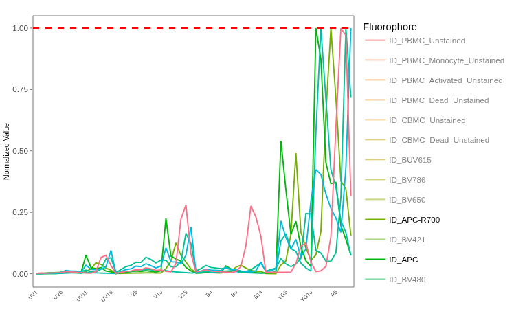

Due to the sheer number of `plotly` `ggplotly()` interactive plots that the website would need to load if we had visualized all the `LuciernagaIntegration()` plots for the 29-fluorophore panel in one go, we have broken the exploration of the fluorophore outputs by laser. The walk-through of the "Red" fluorophores has been migrated [here](/course/SDY3080/LuciernagaIntegration_Red.qmd). 

### Autofluorescence

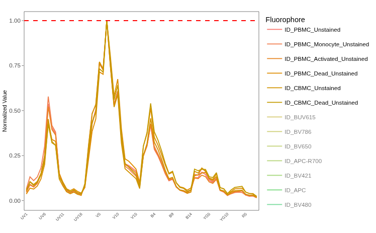

Due to the sheer number of `plotly` `ggplotly()` interactive plots that the website would need to load if we had visualized all the `LuciernagaIntegration()` plots for the 29-fluorophore panel in one go, we have broken the exploration of the fluorophore outputs by laser. The walk-through of the "Unstained" signatures has been migrated [here](/course/SDY3080/LuciernagaIntegration_Unstained.qmd). 

# Take Away

In this walk-through (and its subsetted "Laser" chapters), we have systematically worked our way through the unmixing controls (both single-color and unstained) for this 29-color panel. Overall, most of the fluorophores were in good shape, only returning a single signature for cells within our gated region, or with signature variants that were highly similar and not likely to cause much trouble at the time of unmixing. 

And then, we also encountered 6 problematic cell single-color unmixing controls. These included

- BUV615

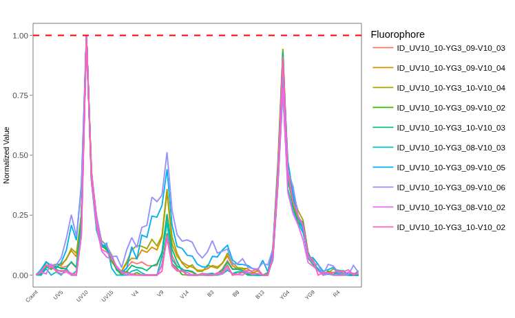

- BUV737

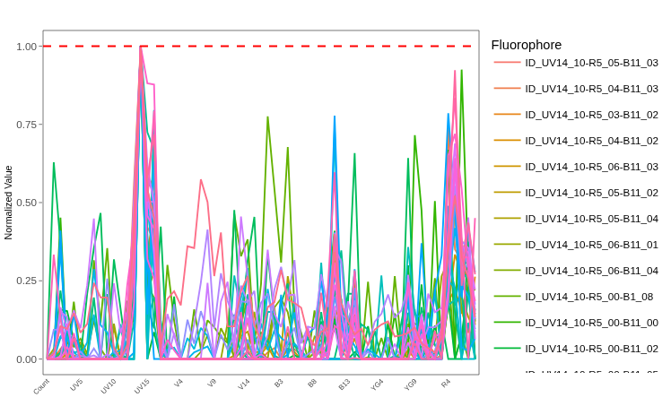

- BV421

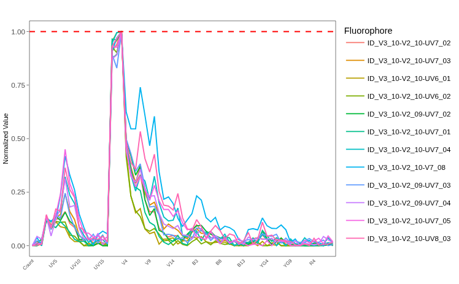

- PerCP-Cy5.5 (not a proper fail, but a caution)

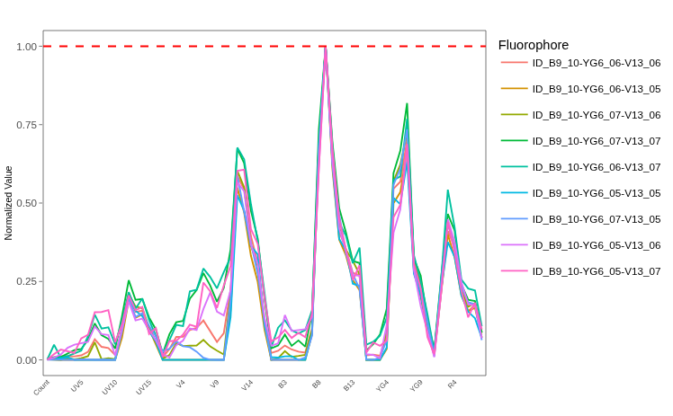

- PE-Cy5

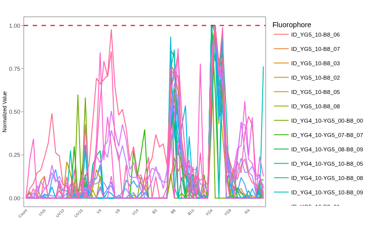

- APC-Fire 810

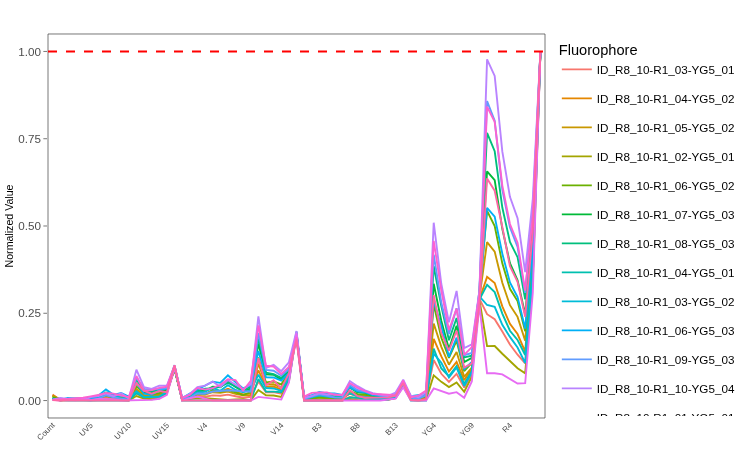

While differing in their extent, BUV737, PE-Cy5 and APC-Fire 810 are in the worst shape, and would likely cause issues with the unmixing of the full-stained samples if they were included within the unmixing matrix.

Likewise, we looked at unstained samples and characterized the autofluorescence variation that is present within. Main things we noticed were shift in secondary peak usage for cord blood vs peripheral blood mononuclear cells, and some interesting variation in the height of the secondary "UV7" detector that ties into how similar the signature compares to our autofluorescence-similar fluorophores. 

- INF052 Ctrl (CBMC)

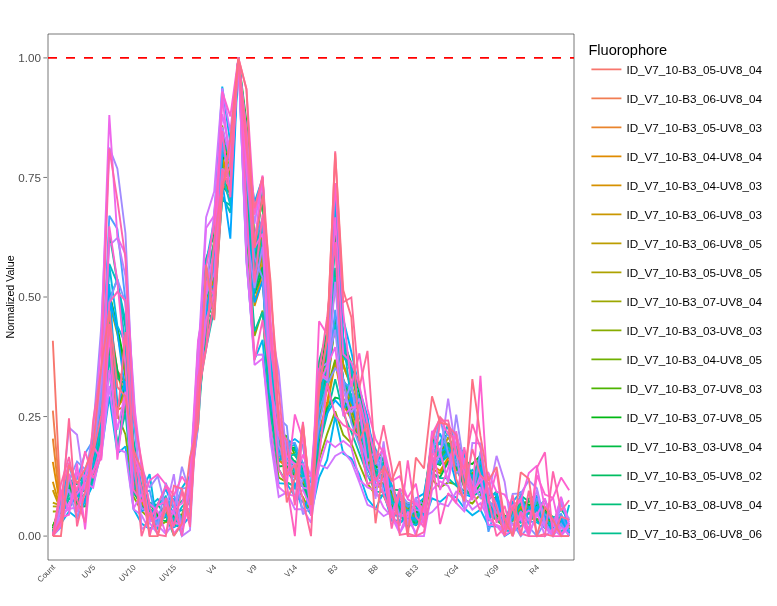

- ND006 Ctrl (PBMC)

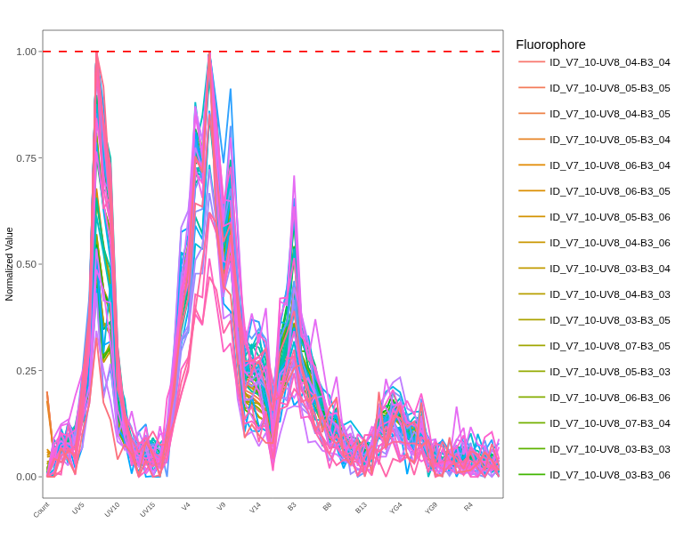

We will circle back to these bad unmixing control signatures during [Week 15](/Schedule.qmd#evaluating-unmixing) and evaluate what kind of unmixing errors they would generate compared to full-stained samples that had been unmixed with more representative fluorophore signatures. Until then, have fun looking at your own single-color unmixing controls, and make sure to share any interesting tandem-degradation finds on the [Discussions Page](https://github.com/UMGCCCFCSR/CytometryInR/discussions)


# Additional Resources

[Luciernaga Vignette - Reference Library](https://davidrach.github.io/Luciernaga/articles/QualityControl.html#comparing-normalized-signatures)

[Luciernaga Vignette - Fluorescent Signatures](https://davidrach.github.io/Luciernaga/articles/FluorescenceSignatures.html)

::: {style="text-align: right;"}
[](https://www.gnu.org/licenses/agpl-3.0.en.html) [](http://creativecommons.org/licenses/by-sa/4.0/)
:::


