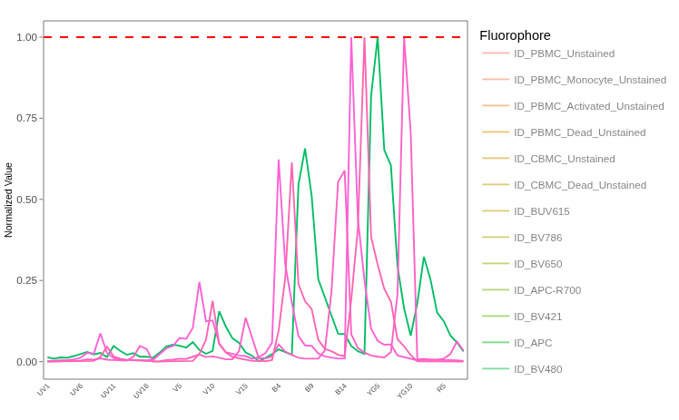

::: {style="text-align: right;"}
[](https://www.gnu.org/licenses/agpl-3.0.en.html) [](http://creativecommons.org/licenses/by-sa/4.0/)
:::

For the YouTube livestream schedule, see [here](https://www.youtube.com/@cytometryinr)

For screen-shot slides, click [here](/course/SDY3080/LuciernagaIntegration_YellowGreen_slides.qmd)

<br>

---

# Background

Due to the sheer number of `plotly` `ggplotly()` interactive plots that the website would need to load if we had visualized all the `LuciernagaIntegration()` plots for the 29-fluorophore panel in one go, we have broken the exploration of the fluorophore outputs by laser. This walk-through if for the "Yellow-Green" laser.

- To return to the main walk-through (including UV fluorophores), click [here](/course/SDY3080/LuciernagaIntegration.qmd)
- For the violet fluorophore walk-through, click [here](/course/SDY3080/LuciernagaIntegration_Violet.qmd)
- For the blue fluorophore walk-through, click [here](/course/SDY3080/LuciernagaIntegration_Blue.qmd)
- For the yellow-green fluorophore walk-through, click [here](/course/SDY3080/LuciernagaIntegration_YellowGreen.qmd)
- For the red fluorophore walk-through, click [here](/course/SDY3080/LuciernagaIntegration_Red.qmd)
- For the unstained samples walk-through, click [here](/course/SDY3080/LuciernagaIntegration_Unstained.qmd)

# Walk-through

## Set Up

Attach your R packages to the local environment via the `library()` call. 

```{r}
library(dplyr)
library(purrr)
library(flowWorkspace)
library(Luciernaga)
library(ggplot2)
```

Designate your file paths to the storage and output folder locations. 

```{r}
#StorageLocation <- file.path("course", "SDY3080", "data", "SDY3080")
StorageLocation <- file.path("data", "SDY3080")

#OutputLocation <- file.path("course", "SDY3080", "outputs")
OutputLocation <- file.path("outputs")
```

Bring in the pre-gated GatingSet object (which was carried out as part of the [Signature Matrices](/course/SDY3080/SignatureMatrices.qmd) walkthrough).

```{r}
CellSCPath <- file.path(OutputLocation, "CellsSC_GS_Amplified.gs")
CellsSC_GatingSet <- load_gs(CellSCPath)
```

And bring in the template needed to run the `LuciernagaIntegration()` wrapper function (which we generated [here](/course/SDY3080/LuciernagaIntegration.qmd#assembling-template)). 

```{r}
#| echo: FALSE
SaveThisTemplateHere <- file.path(OutputLocation, "KeptCells.csv")
KeptCells <- read.csv(SaveThisTemplateHere, check.names=FALSE)
```

And with that, we are set! 

### YellowGreen



Next up, we have the Yellow-green laser. Originally, the 29-fluorophore panel had been designed for use on a 4-laser Cytek Aurora, so the switch to a 5-laser instrument meant the original panel's fluorophores got distributed across both the blue and yellow-green lasers (which is why the Blue and Yellow-green detector slots are underutilized, with 3 and 4 fluorophores respectively). 

In terms of what to expect,  typically for PBMCs autofluorescence is not as much of an issue for the yellow-green laser. However, many of the fluorophores are PE conjugates, which means we might encounter some tandem degration. Importantly, many cell types will non-specifically stain for PE dyes (due to tendency to either endocytose or latch-on), which can impact the use of internal negatives for background subtraction in panels that don't add blocking reagents. We will see if we can identify any of these outcomes as we go for the cell single-color unmixing controls in this panel. 

#### PE

Starting of the Yellow-green laser, we have our [PE](https://www.biolegend.com/en-us/products/pe-anti-human-cd314-nkg2d-antibody-3016) fluorophore, in this case conjugated to [NKG2D](https://en.wikipedia.org/wiki/NKG2D). As this marker is widely expressed on NK cells, it should result in a bright antigen-by-fluorophore combination. 

```{r}
PE <- LuciernagaIntegration(template=KeptCells[20,],
 gs=CellsSC_GatingSet, GuessSimilar=TRUE)[[1]] # Square brackets to loose list notation
```

Lets begin by checking the "LinearSlices_Plot" output, to see what the effect would have been on the signature if we had split the region within our "positive" gate into 10% bins across based on MFI for the peak-detector. 

```{r}
Plot <- PE$LinearSlices_Plot
plotly::ggplotly(Plot)
```

Similar to what we have encountered for other bright antigen-by-fluorophore combinations, everything appears consistent for the fluorophore peaks, with just a hint of uncertainty around the "V7-A" detector. With this noted, we can check the `LuciernagaQC()` output to see variant signatures returned when we group individual cell normalized signatures based on shared peaks of similar height. 

```{r}
Plot <- PE$LuciernagaQC_Signatures
plotly::ggplotly(Plot)
```

We get back a few signature variants, a couple with some evidence of autofluoresence residual contribution to the overall signatures around the "V8-A" detector. We can next proceed to check the `QC_Amalgamate()` output, to see where the the median signature ends up.

```{r}
Plot <- PE$LuciernagaQC_AmalgamatedPlot
plotly::ggplotly(Plot)
```

Median signature ends up with a bit of autofluorescence residual present, which likely means these signatures are represented by a decent portion of cells within the gated region. Lets check the proportion plot

```{r}
Plot <- PE$ProportionPlot
plotly::ggplotly(Plot)
```

This is probably one of the first fluorophores we encountered where there was relatively even distribution across multiple signature variants, which is rather interesting. 

To investigate further, we can retrieve the underlying data for this plot, and keep the Average, as well as variants with minimal and maxinum autofluorescence contribution of the autofluorescence peak. 

```{r}
Data <- PE$AveragedSignature_Data |>
   filter(Cluster %in% c("YG1_10-B4_07", "Average", "YG1_10-B4_06-V8_03"))
```

Lets pass these individually to `QC_SimilarFluorophores()` and gage the difference. 

```{r}
QC_WhatsThis(x="YG1_10-B4_07", columnname="Cluster", data=Data, NumberHits=5, NumberDetectors=64, returnPlots=FALSE) #0.99
```

```{r}
QC_WhatsThis(x="Average", columnname="Cluster", data=Data, NumberHits=5, NumberDetectors=64, returnPlots=FALSE) #0.99
```

```{r}
QC_WhatsThis(x="YG1_10-B4_06-V8_03", columnname="Cluster", data=Data, NumberHits=5, NumberDetectors=64, returnPlots=FALSE) #0.98
```

So similar overall, if we visualized the difference in these cosine values, we would see the following

```{r}
#| code-fold: TRUE
cos_vals <- c(1, 0.99, 0.98)
theta <- acos(cos_vals)

df <- data.frame(
  label = paste0("cos = ", cos_vals),
  angle_deg = round(theta * 180 / pi, 1),
  x = sin(theta),
  y = cos(theta)
)

ggplot(df) +
  geom_segment(aes(x = 0, y = 0, xend = x, yend = y, color = label),
               arrow = arrow(length = unit(0.25, "cm")),
               linewidth = 1) +
  coord_fixed(xlim = c(-0.1, 1), ylim = c(-0.1, 1.1)) +
  geom_hline(yintercept = 0, color = "grey80") +
  geom_vline(xintercept = 0, color = "grey80") +
  labs(x = NULL, y = NULL, color = "Vector",
       title = NULL) +
  theme_bw()
```

All the above seem a bit off from the reference, we can go ahead and verify what the difference actually is by re-running the "Average" signature but set the 'returnPlots' argument to TRUE. 

```{r}
Plot <- QC_WhatsThis(x="Average", columnname="Cluster", data=Data, NumberHits=5, NumberDetectors=64, returnPlots=TRUE)[[2]] #0.99
plotly::ggplotly(Plot)
```

:::{.callout-tip title="Pass"}
Overall, the variant signatures for PE are relatively similar to each other. There is however a bit of a difference compared to the reference, with the secondary "B4-A" peak having greater proportion compared to the primary "YG1-A" peak for our single-color control than what was seen for the reference. 

Whether this is due to instrument-specific gain settings (or because something is clipping the main "YG1-A" detectors height) would be something we would need to check vs. other PE signatures acquired on the same instrument to make a determination.
 
Overall, we can attempt to clean up some of the autofluorescence residual shoulder by shifting the gate slightly to the right, which should get rid of these dimmer cells, leaving only cells that are brighter for PE left to contribute to the overall signature.
:::

#### PE-Dazzle 594

Up next is [PE-Dazzle 594](https://www.biolegend.com/en-us/products/pe-dazzle-594-anti-human-tnf-alpha-antibody-10268), which is conjugated to [TNFa](https://en.wikipedia.org/wiki/Tumor_necrosis_factor). Since this cell single-color unmixing control was prepared with adult PBMCs, stimulated with PMA-ionomycin for 6-hours before intracellular staining, we can anticipate the overall signal to be bright. But since it is a PE-tandem, things may still prove to be interesting.

```{r}
PEDazzle594 <- LuciernagaIntegration(template=KeptCells[21,],
 gs=CellsSC_GatingSet, GuessSimilar=TRUE)[[1]] # Square brackets to loose list notation
```

Lets first take a look at the "LinearSlices_Plot", to see what the effect would have been on the signature if we had split the region in our "positive" gate into 10% bins across based on MFI for the peak-detector. 

```{r}
Plot <- PEDazzle594$LinearSlices_Plot
plotly::ggplotly(Plot)
```

Nice! Almost no variation whatsoever across any of the 10% bins. Having noted this, lets check out the `LuciernagaQC()` grouped individual cell normalized signatures output that is stored under "LuciernagaQC_Signatures". 

```{r}
Plot <- PEDazzle594$LuciernagaQC_Signatures
plotly::ggplotly(Plot)
```

Alright, barely any variant signatures by the `LuciernagaQC()` approach, being barely different on the "B6-A" detector (likely partially how rounding is carried out in the parent function). Lets quickly check to see how the median signature differs compared to the reference. 

```{r}
Data <- PEDazzle594$AveragedSignature_Data 
```

```{r}
Plots <- QC_WhatsThis(x="Average", columnname="Cluster", data=Data, NumberHits=5, NumberDetectors=64, returnPlots=TRUE)
Plots[[1]]
plotly::ggplotly(Plots[[2]])
```

:::{.callout-tip title="Pass"}
PE-Dazzle 594 is in good condition, with the signature variants being identical to the reference signature. On to the next fluorophore!
:::


#### PE-Cy5

Up next we encounter [PE-Cy5](bdbiosciences.com/en-us/products/reagents/flow-cytometry-reagents/research-reagents/single-color-antibodies-ruo/pe-cy-5-mouse-anti-human-cd25.555433), which is conjugated to [CD25](https://en.wikipedia.org/wiki/IL2RA) in this panel. As the high-affinity IL-2 receptor, this antigen will be a little more sparsely distributed across individual cell subsets, so depending on the donor additional cells might need to be acquired for this cell single-color unmixing control to end up with enough bright positive events. Additionally, the antigen density is likely to be lower on the cells, which is likely one of the reasons it was paired with the usually bright PE-Cy5 fluorophore.

```{r}
PECy5 <- LuciernagaIntegration(template=KeptCells[22,],
 gs=CellsSC_GatingSet, GuessSimilar=TRUE)[[1]] # Square brackets to loose list notation
```

Lets first take a look at the "LinearSlices_Plot", to see what the effect would have been on the signature if we had split the region in our "positive" gate into 10% bins across based on MFI for the peak-detector.

```{r}
Plot <- PECy5$LinearSlices_Plot
plotly::ggplotly(Plot)
```

Oh no!!! As we place 10% bins across our "Positive" gate, we can already see that the signatures from each bin show a step-ladder for the autofluorescence peak detectors. Worse, if we glance at the fluorophore driven peaks, we can note step-ladders for both the "B8-A" and "R2-A" detectors. Together, this suggest the antigen-fluorophore combination is dimmer than anticipated, or worse, that the tandem might be breaking up. 

Having noted this, lets check out the `LuciernagaQC()` output, to see what variant signatures we get back when we group individual cell normalized signatures together based on shared peaks of similar heights. 

```{r}
Plot <- PECy5$LuciernagaQC_Signatures
plotly::ggplotly(Plot)
```

... something is truly badly off for this antigen-fluorophore combination ...  clicking and unclicking through the interactive plot, we can see some signatures with multiple peaks, some with 2, some with just one. At this point, it might be useful to remember what the PE-CY5 is actually suppossed to look like. 

```{r}
QC_ReferenceLibrary("PE-Cy5", 64, returnPlots=TRUE)[[2]] |>
  plotly::ggplotly() 
```

So... assuming this fluorophore is indeed a PE-Cy5 (and not a PE-Cy5.5 that was mislabeled) we would expect a peak at"YG5", secondary at "B8", small peaks at "R2" and "V11". In a mislabelled scenario, we would expect the two main peaks shifted forward by one detector. Looking at our retrieved data, there only appears to be a couple of these types of signatures present. 

Before moving forward, we had mentioned earlier the potential for [non-specific](/course/SDY3080/LuciernagaIntegration_YellowGreen.qmd#walk-through) staining affecting our internal unstained, throwing off the background subtraction, and resulting in odd-looking signatures. To rule out what we see above being a result of non-specific staining by the PE-Cy5, lets go ahead and switch to using an external unstained. 

To do this, we will need to bring in the reference from the Unstained GatingSet we pre-gated in a [previous walkthrough](/course/SDY3080/SetUp.qmd#cells---unstained) using `load_gs()`. For the PE-Cy5 cell single-color unmixing control, the donor would have been the adult PBMC donor for the control condition, so we can use `subset()` to slim down the GatingSet to just our specimen of interest

```{r}
UnstainedHere <- file.path(OutputLocation, "CellsUnstained_GS.gs")
Unstained_GatingSet <- load_gs(UnstainedHere)
# pData(Unstained_GatingSet)
Unstained_GatingSet <- subset(Unstained_GatingSet, stringr::str_detect(name, "ND006_v1-Ctrl"))
```

Checking the existing gates, we can see we will need to retrieve the scatter gate. 

```{r}
plot(Unstained_GatingSet)
```

To utilize an external reference control, we will need to modify the arguments being used for the `LuciernagaIntegration()` wrapper function. We should quickly check the documentation help pages. 

```{r}
#| eval: FALSE
?LuciernagaIntegration()
```


The arguments we will need to use appear to be the three "externalAF_gs" arguments, providing the GatingSet name, the specimen index, and the gate name which contains the cells we plan to use for the background subtraction. Armed with this knowledge, lets modify the previous code for PE-Cy5

```{r}
PECy5 <- LuciernagaIntegration(template=KeptCells[22,],
 gs=CellsSC_GatingSet, GuessSimilar=TRUE,
 externalAF_gs = Unstained_GatingSet, externalAF_gs_index = 1,
 externalAF_gs_gate = "scatter")[[1]] # Square brackets to loose list notation
```

Alright, with the subtraction using external background autofluorescence, lets see what we get. 

```{r}
Plot <- PECy5$LinearSlices_Plot
plotly::ggplotly(Plot)
```

Nope, still some obvious step-ladders. How about for `LuciernagaQC()` output? 

```{r}
Plot <- PECy5$LuciernagaQC_Signatures
plotly::ggplotly(Plot)
```

Still functionally identical to the results we had for internal unstained, which rules out what we are seeing being due to the presence of non-specific staining during the background subtraction step. 

Which means, that our cell single-color unmixing control must just be in really bad shape (likely from a combination of dim antigen-by-fluorophore combination, and tandem breaking apart, etc.)

Lets visualize the previous plot in an alternative fashion, checking to see where the median signature ends up by comparison. 

```{r}
Plot <- PECy5$LuciernagaQC_AmalgamatedPlot
plotly::ggplotly(Plot)
```

Our median "Average" signature from the `QC_Amalgamate()` output has the primary at "YG5", secondary at "B9", with no secondary peaks present. 

Lets take a look at the "ProportionPlot" output, and see if we can find any signatures that resemble the reference "YG5_10-B8_06-R2_02"

```{r}
Plot <- PECy5$ProportionPlot
plotly::ggplotly(Plot)
```

Recalling that our PE-Cy5 should have up to four peaks, as we scroll through the list, we can see that the only two signatures that resemble are less than 4% of the stained cells. There are a couple other signatures that have similar structure with "V11" peaks, but they also have substantial autofluorescence leftovers present on "V8".  

At this point, lets just compare the more abundant signatures vs. the reference via `QC_SimilarFluorophores()`. 

```{r}
Data <- PECy5$AveragedSignature_Data |>
   filter(Cluster %in% c("YG5_10-B8_07", "Average", "YG5_10-B8_03"))
```

```{r}
QC_WhatsThis(x="YG5_10-B8_07", columnname="Cluster", data=Data, NumberHits=5, NumberDetectors=64, returnPlots=FALSE) # 0.97
```

```{r}
QC_WhatsThis(x="Average", columnname="Cluster", data=Data, NumberHits=5, NumberDetectors=64, returnPlots=FALSE) # 0.97
```

```{r}
QC_WhatsThis(x="YG5_10-B8_03", columnname="Cluster", data=Data, NumberHits=5, NumberDetectors=64, returnPlots=FALSE) # 0.85
```

So 0.85, 0.97 and 0.97 for the cosine values. We can visualize these difference in cosine to see how far off they are from the reference. 

```{r}
#| code-fold: TRUE
cos_vals <- c(1, 0.85, 0.97)
theta <- acos(cos_vals)

df <- data.frame(
  label = paste0("cos = ", cos_vals),
  angle_deg = round(theta * 180 / pi, 1),
  x = sin(theta),
  y = cos(theta)
)

ggplot(df) +
  geom_segment(aes(x = 0, y = 0, xend = x, yend = y, color = label),
               arrow = arrow(length = unit(0.25, "cm")),
               linewidth = 1) +
  coord_fixed(xlim = c(-0.1, 1), ylim = c(-0.1, 1.1)) +
  geom_hline(yintercept = 0, color = "grey80") +
  geom_vline(xintercept = 0, color = "grey80") +
  labs(x = NULL, y = NULL, color = "Vector",
       title = NULL) +
  theme_bw()
```

And if we contrast the average against the reference signature. 

```{r}
Plot <- QC_WhatsThis(x="Average", columnname="Cluster", data=Data, NumberHits=5, NumberDetectors=64, returnPlots=TRUE)
Plot[[1]]
plotly::ggplotly(Plot[[2]])
```

Finally, we can retrieve the cosine plot for all signature variants. 

```{r}
Plot <- PECy5$CosineSimilarityPlot
plotly::ggplotly(Plot)
```

So one cluster of signatures that are relatively similar to each other, with a gradient of less similar signatures until we get to those single peak leftovers. 


:::{.callout-warning title="Fail"}
It goes without saying that this PE-Cy5 unmixing control is having several issues. We see step-ladders on the autofluorescence detectors via 'LinearSlices', which suggest the antigen-by-fluorophore combination is particularly dim in practice. Additionally, compared to the reference, it is missing a couple smaller peaks! Whether the missing peaks is because of the relatively dim staining, variation in how the manufacturer is conjugating, etc. is hard to tell, since we also have signatures that suggest tandem degradation. 

Ultimately, looking at the distribution of cells across signatures, we don't have a rosy picture that if we gate this cell single-color unmixing control in the normal way we are going to get a representative signature to properly unmix the full-stained cells. So we should likely exclude it, and find a replacement, rather than spend time trying to identify what signature variant would do the least-bad unmixing. 

In the actual dataset, the minute we replaced this cell single-color control with the bead single-color control, our unmixing [dramatically improving](https://davidrach.github.io/SingleColors_Cyto2025/SingleColorsPoster.pdf). Ultimately, despite PE-Cy5's reputation for being bright, in this context the antigen/fluorophore/titration combination was just not adequate.
:::

#### PE-Vio 770

And our final fluorophore for the Yellow-Green laser is [PE-Vio 770](https://www.miltenyibiotec.com/US-en/products/cd279-pd1-antibody-anti-human-pd1-3-1-3.html#Conjugate=PE-Vio-770:size=100-tests-in-200-uL), conjugated to [PD1](https://en.wikipedia.org/wiki/Programmed_cell_death_protein_1). While the antigen density may not be terribly high, coupled to a relatively bright fluorophore gives this unmixing control a fighting chance. We will see shortly if it works out that way in practice. 

```{r}
PEVio770 <- LuciernagaIntegration(template=KeptCells[23,],
 gs=CellsSC_GatingSet, GuessSimilar=TRUE)[[1]] # Square brackets to loose list notation
```

Lets first take a look at the "LinearSlices_Plot", to see what effect would have been on the signature if we had split the region within our "positive" gate into 10% bins across based on MFI for the peak-detector.

```{r}
Plot <- PEVio770$LinearSlices_Plot
plotly::ggplotly(Plot)
```

Overall, not bad (especially compared to [PE-Cy5](/course/SDY3080/LuciernagaIntegration_YellowGreen.qmd#pe-cy5)), we have a small step ladder for "V7-A", and a bit of clipping occuring on the "B13-A" secondary peak, but we have seen worse. With this noted, lets check out the `LuciernagaQC()` output to see what the grouped individual cell normalized signatures stashed under "LuciernagaQC_Signatures" are up to. 

```{r}
Plot <- PEVio770$LuciernagaQC_Signatures
plotly::ggplotly(Plot)
```

All things reconsidered, not bad. We have one variant signature with some autofluorescence leftovers, and then everything is fairly consistent with slight differences in the "B13-A" peaks height relative to the primary "YG9-A" detector. Lets check the proportion plots to see how cells are distributed across the variant signatures. 

```{r}
Plot <- PEVio770$ProportionPlot
plotly::ggplotly(Plot)
```

Majority of the cells seem to fall under one signature. Lets visualize this same data in an alternative fashion, checking to see where the median signature ends up by comparison. 

```{r}
Plot <- PEVio770$LuciernagaQC_AmalgamatedPlot
plotly::ggplotly(Plot)
```

Retrieving the underlying data for the signature variants, lets keep the median "Average" signature, as well as a couple variants and see how they compare to the reference control using `QC_SimilarFluorophores()`

```{r}
Data <- PEVio770$AveragedSignature_Data |>
   filter(Cluster %in% c("YG9_10-B13_07-V15_02", "Average", "YG9_10-B13_06-V7_02"))
```

```{r}
QC_WhatsThis(x="YG9_10-B13_07-V15_02", columnname="Cluster", data=Data, NumberHits=5, NumberDetectors=64, returnPlots=FALSE) #0.99
```

```{r}
QC_WhatsThis(x="Average", columnname="Cluster", data=Data, NumberHits=5, NumberDetectors=64, returnPlots=FALSE) #0.99
```

```{r}
QC_WhatsThis(x="YG9_10-B13_06-V7_02", columnname="Cluster", data=Data, NumberHits=5, NumberDetectors=64, returnPlots=FALSE) #0.94
```

So cosine wise, 0.99, 0.99 and 0.94 for the signature with the bit of autofluorescence leftovers. If we visualized the differences, we would see the following

```{r}
#| code-fold: TRUE
cos_vals <- c(1, 0.99, 0.94)
theta <- acos(cos_vals)

df <- data.frame(
  label = paste0("cos = ", cos_vals),
  angle_deg = round(theta * 180 / pi, 1),
  x = sin(theta),
  y = cos(theta)
)

ggplot(df) +
  geom_segment(aes(x = 0, y = 0, xend = x, yend = y, color = label),
               arrow = arrow(length = unit(0.25, "cm")),
               linewidth = 1) +
  coord_fixed(xlim = c(-0.1, 1), ylim = c(-0.1, 1.1)) +
  geom_hline(yintercept = 0, color = "grey80") +
  geom_vline(xintercept = 0, color = "grey80") +
  labs(x = NULL, y = NULL, color = "Vector",
       title = NULL) +
  theme_bw()
```

:::{.callout-tip title="Pass"}
Overall, our PE-Vio770 fluorophore appears to be in good shape, with little autofluorescence leftovers ending up in the signatures. While not exactly matching the reference, the majority of the cells are consitent for the main signatures. There is a bit of clipping happening on the secondary fluorophore peak, so it is worth keeping an eye on over the course of the experiment series, but at least for this first experiment everything looks good enough to proceed. 
:::

# Redirects

Due to the sheer number of `plotly` `ggplotly()` interactive plots that the website would need to load if we had visualized all the `LuciernagaIntegration()` plots for the 29-fluorophore panel in one go, we have broken the exploration of the fluorophore outputs by laser. This walk-through was for the Yellow-green laser fluorophores. 

- To return to the main walk-through (including UV fluorophores), click [here](/course/SDY3080/LuciernagaIntegration.qmd)
- For the violet fluorophore walk-through, click [here](/course/SDY3080/LuciernagaIntegration_Violet.qmd)
- For the blue fluorophore walk-through, click [here](/course/SDY3080/LuciernagaIntegration_Blue.qmd)
- For the yellow-green fluorophore walk-through, click [here](/course/SDY3080/LuciernagaIntegration_YellowGreen.qmd)
- For the red fluorophore walk-through, click [here](/course/SDY3080/LuciernagaIntegration_Red.qmd)
- For the unstained samples walk-through, click [here](/course/SDY3080/LuciernagaIntegration_Unstained.qmd)


# Additional Resources

[Luciernaga Vignette - Reference Library](https://davidrach.github.io/Luciernaga/articles/QualityControl.html#comparing-normalized-signatures)

[Luciernaga Vignette - Fluorescent Signatures](https://davidrach.github.io/Luciernaga/articles/FluorescenceSignatures.html)

::: {style="text-align: right;"}
[](https://www.gnu.org/licenses/agpl-3.0.en.html) [](http://creativecommons.org/licenses/by-sa/4.0/)
:::